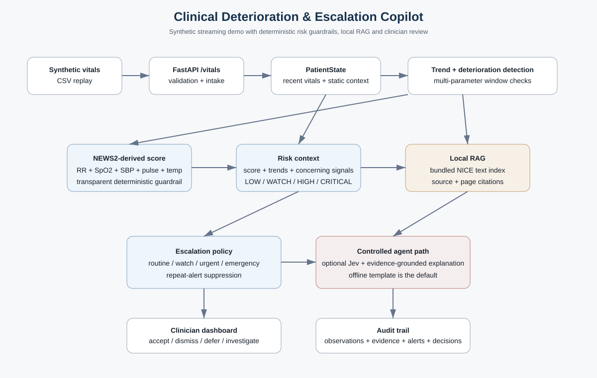

TEAM NUMBER 29
# Agentic Clinical Deterioration & Escalation Copilot

Prototype for the Intra IIT Tech Meet 1.0 PS-1 problem: **Agentic Clinical Deterioration & Escalation Copilot**.

The implementation follows the midterm plan: stream synthetic vitals, keep per-patient state, detect multi-parameter trends, calculate a deterministic NEWS2-derived score from the variables available in the demo, suppress repeated alerts, retrieve local guideline evidence, generate a plain-language explanation, and keep the clinician in the loop through the dashboard and audit log.

> **Important:** this is a synthetic-data hackathon prototype, not a clinical device or a medical decision-maker.

## What is implemented

### Streaming and state

- `src/streaming/streamer.py` replays `data/raw/synthetic_vitals.csv` over HTTP.
- `src/api/main.py` receives each observation at `POST /vitals`.
- `src/state/state_manager.py` loads the static patient profile once and creates an evolving `PatientState` per patient.
- Recent observations are kept in a bounded history and are ordered by timestamp.
- Duplicate timestamps are ignored; out-of-order readings are accepted and inserted in timestamp order; clearly impossible demo values are rejected.

### Detection and risk

- `src/detection/trend_detection.py` compares two short rolling windows instead of triggering on one reading.
- `src/detection/deterioration_detecter.py` looks for several concerning directions moving together.
- `src/scoring/news2.py` calculates a deterministic NEWS2-derived score from respiratory rate, SpO2, systolic BP, pulse and temperature. Missing challenge inputs are not fabricated.
- `src/scoring/risk_ranking.py` turns the deterministic evidence into `LOW`, `WATCH`, `HIGH` or `CRITICAL` context.

### Escalation and agent/RAG path

- `src/agent/jev_judge.py` contains the optional structured Jev integration and a deterministic offline fallback.
- `src/rag/retriever.py` retrieves guideline passages from the bundled local index in `data/guidelines/index.json`.
- `src/agent/llm_explain.py` uses a simple evidence-first template by default. Anthropic is optional and only used when `ANTHROPIC_API_KEY` is explicitly supplied.
- `src/agent/escalation.py` applies deterministic guardrails before the optional agent/explanation path. A high NEWS2-derived score is not downgraded by the optional judge.

### Alert control, clinician loop, audit

- Repeated alerts with the same priority/action/source within 30 minutes are suppressed.
- `POST /patients/{patient_id}/decision` accepts `accept`, `dismiss`, `defer` or `investigate`.
- `src/audit/logger.py` writes an append-only JSONL audit trail.
- The dashboard receives live updates over WebSocket.

## Architecture



```text
synthetic_vitals.csv
       |
       v
  HTTP streamer
       |
       v
   FastAPI /vitals
       |
       v
  PatientState <---- static patient profile
       |
       +--> rolling trend detection
       |
       +--> multi-parameter deterioration
       |
       +--> deterministic NEWS2-derived score
       |
       +--> local guideline retrieval (RAG)
       |
       +--> escalation policy
              |
              +--> routine / watch / urgent
              |
              +--> strong or critical -> structured judge -> explanation
                                     |
                                     v
                              clinician dashboard
                                     |
                              accept/dismiss/defer/
                                 investigate
                                     |
                                     v
                                 audit log
```

## Setup

Python 3.11+ is recommended.

### Windows PowerShell

```powershell
python -m venv venv
.\venv\Scripts\Activate.ps1
pip install -r requirements.txt
```

### macOS / Linux

```bash
python3 -m venv venv
source venv/bin/activate
pip install -r requirements.txt
```

No API key is required for the default demo.

## Run the demo

### Terminal 1 - API + dashboard

```bash
python -m uvicorn src.api.main:app --reload --host 127.0.0.1 --port 8001
```

Open:

```text
http://127.0.0.1:8001/
```

### Terminal 2 - stream synthetic deterioration

The demo defaults to patient 3 and starts around the deterioration phase so the effect is visible quickly.

```bash
python src/streaming/streamer.py
```

You can also choose the patient and replay window manually:

```bash
python src/streaming/streamer.py --patient 3 --start 80 --rows 45 --delay 0.35
```

Useful demo endpoints:

- `GET /health`
- `GET /patients`
- `GET /patients/{patient_id}/state`
- `GET /audit?patient_id=3`
- `POST /patients/{patient_id}/decision`
- `POST /demo/reset`
- `WS /ws`

## Demo flow

1. Open the dashboard before starting the streamer.
2. Start the streamer and watch the patient card update after each observation.
3. Explain that the first few readings are not enough for trend detection.
4. As the trajectory worsens, point out the multi-parameter trend count and the NEWS2-derived score.
5. Show an urgent / high / emergency response appearing in the dashboard.
6. Continue the stream and point out when repeated alerts are suppressed.
7. Open the patient state to show age, diagnosis, recent vitals and retrieved evidence.
8. Use **Investigate** or **Accept** on an alert.
9. Finish by showing `GET /audit?patient_id=3` or the saved audit file.

## Tests

Run the complete suite with:

```bash
python -m pytest -q
```

The current suite covers:

- deterministic NEWS2-derived scoring,
- trend detection,
- insufficient-data handling,
- escalation branches,
- pipeline integration,
- duplicate timestamps,
- out-of-order observations,
- validation of impossible values,
- repeated-alert suppression,
- offline Jev behavior.

## Guideline corpus

The local RAG corpus currently contains the bundled NICE documents under `data/guidelines/documents/`.
`data/guidelines/index.json` is a prebuilt text/chunk index generated from those PDFs so the web server does not need to parse PDFs during a patient request.

The source metadata is recorded in `data/guidelines/sources.json`.

## Final submission files

- `README.md` - setup, architecture and demo instructions
- `docs/architecture.svg` - architecture diagram
- `docs/FINAL_TECHNICAL_DOCUMENTATION.md` - final implementation notes
- `data/raw/synthetic_vitals.csv` - reproducible synthetic stream used by the demo
- `data/patient_profiles/patient_demographics.csv` - static synthetic patient context
- `demo/README.md` - compact demo checklist and talking points
- `tests/` - automated test suite

## Changes from the midterm plan

The original midterm described a more open-ended agent/RAG stack. The final implementation keeps the same major stages but makes the demo deterministic and easy to reproduce:

- local keyword retrieval is used instead of a hosted vector database;
- Jev is optional, with a deterministic local fallback;
- the explanation is template-based by default, with an optional Anthropic path;
- the clinician loop and audit trail are implemented directly in the FastAPI backend;
- the dashboard is a small same-origin HTML/JavaScript page, so no separate frontend build is needed.

These changes reduce setup requirements while keeping the flow of the proposed architecture intact.

## Limitations

- All patient data are synthetic.
- The trend detector is intentionally simple and explainable; it is not a validated clinical deterioration model.
- The NEWS2 calculation uses only the physiological variables available in this challenge dataset; it does not invent unavailable inputs.
- The local retriever is keyword-based, not semantic embedding retrieval.
- External LLM/Jev integrations are optional and not required for the recorded demo.
- No clinical validation or deployment safety certification has been performed.
